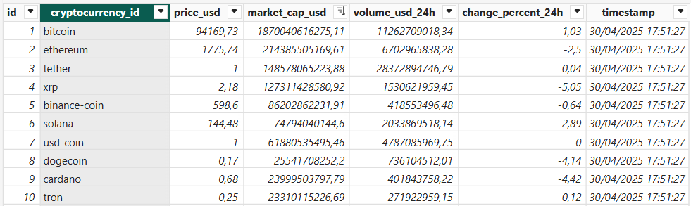
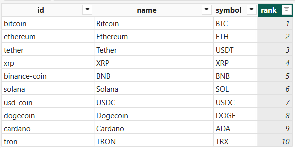

# DESAFIO TÉCNICO

## Objetivo
O projeto consiste em criar uma aplicação python modularizada que faça o ETL, extraindo os dados da API de criptomoedas CoinCap e armazenando esses dados em um banco de dados relacional. A partir dos dados armazenados no banco, criar um Dashboard em Power BI.
Para o projeto, foi utilizado o banco de dados Postgresql, por ser um banco open source mais robusto. Foram criadas duas tabelas, 
'cryptocurrencies', que exibe os dados das criptomoedas e 'market_data', que mostra os dados de mercado dessas criptomoedas.

A seguir mostra as colunas e tipo de dados dessas tabelas:

Tabela cryptocurrencies:
| Campo | Tipo        | Descrição                     |
|-------|-------------|-------------------------------|
| `id`  | `string`    | ID da criptomoeda             |
| `name` | `string`   | Nome da criptomoeda           |
| `symbol` | `string` | Símbolo da criptomoeda        |
| `rank` | `integer`  | Posição (ranking) da criptomoeda |

Tabela market_data:
| Campo                 | Tipo      | Descrição                                                   |
|-----------------------|-----------|-------------------------------------------------------------|
| `id`                  | `integer` | Identificação única do registro na tabela (chave primária) |
| `cryptocurrency_id`   | `string`  | ID da criptomoeda (chave estrangeira de `cryptocurrencies`) |
| `price_usd`           | `float`   | Preço da criptomoeda em dólar                              |
| `market_cap_usd`      | `float`   | Capitalização de mercado em dólar                          |
| `volume_usd_24hr`     | `float`   | Volume de negociação em dólar nas últimas 24 horas         |
| `change_percent_24hr` | `float`   | Variação percentual do preço nas últimas 24 horas          |
| `timestamp`           | `datetime`| Data e hora em que os dados foram inseridos no banco       |


Link da documentação da API: https://pro.coincap.io/api-docs

## Estrutura do projeto
<pre><code>
Desafio_cadastra/
│
├── app/
│   ├── __init__.py
│   ├── config.py         # Configurações (variáveis de ambiente, parâmetros)
│   ├── database.py       # Conexão e funções do banco de dados
│   ├── api_client.py     # Conexão e requisições à API
│   ├── models.py         # Modelagem das tabelas
│   ├── ingestion.py      # Lógica de coleta e gravação dos dados
├── requirements.txt      # Bibliotecas utilizadas no projeto
├── README.md             # Instruções do projeto
├── .env                  # Variáveis de ambiente (não enviado ao GitHub)
├── docker-compose.yml    # Arquivo docker compose com serviço Postgresql
├── .gitignore            # Arquivos para o git ignorar
├── create_tables.py      # Script que cria as tabelas no banco
└── main.py               # Script principal </code></pre>


## Pré-requisitos
- Ter o Python 3.10 ou superior instalado. No meu ambiente, usei o Python 3.10.14. Recomendo usar o mesmo.

Para instalar o python no Linux (Debian/Ubuntu) usando o repositório:

```
sudo apt-get install software-properties-common

sudo add-apt-repository ppa:deadsnakes/ppa

sudo apt-get install python3.10

# para instalar bibliotecas que podem estar ausentes e ajudam na criação de ambiente virtual
sudo apt install python3.10-venv python3.10-dev python3.10-distutils
```

- Ter o Docker Engine e o Docker compose instalado (Usei a versão para WSL2 no Windows):

https://docs.docker.com/desktop/setup/install/windows-install/

https://docs.docker.com/engine/install/ubuntu/#install-using-the-repository (usando o repositório apt no Ubuntu)

- Ter o Power BI desktop instalado

https://www.microsoft.com/pt-br/power-platform/products/power-bi

- Criar conta no Coincap para obter chave API

## Execução
Obs: todos os comandos listados a seguir foram executados em um terminal do sistema Linux Ubuntu. Caso seu sistema seja diferente, verificar os comandos correspondentes no mesmo.

- clonar o repositório do projeto:

    `git clone git@github.com:Priscaruso/Desafio_cadastra.git`
- criar um ambiente virtual para instalação dos pacotes necessários

    `python3.10 -m venv venv`
- ativar ambiente virtual criado

    `source venv/bin/activate`

- atualizar o pip, caso necessário

    `pip install --upgrade pip`

- instalar os pacotes necessários contidos no arquivo requirements.txt

    `pip install -r requirements.txt`

- criar o arquivo .env no diretório do projeto

    `touch .env`
- configurar as credenciais de acesso dentro do arquivo .env, substituindo <your_password>, <your_db>, <your_user> e yourapikey pelos seus dados 

    ```
    API_URL = https://rest.coincap.io/v3/assets?apiKey=yourapikey

    POSTGRES_DB = <your_db>
    POSTGRES_USER = <your_user>
    POSTGRES_PASSWORD = <your_password>
    PORTS=5432

    DATABASE_URL = postgresql://<your_user>:<your_password>@<localhost:5432/<your_db>
    ```

- construir o container com o Postgres usando o Docker compose file

    `sudo docker compose up -d`
- verificar se o container foi criado corretamente

    `docker ps`
- rodar o script python que cria as tabelas no banco

    `python3.10 create_tables.py`
- rodar o script python que executa o ETL

    `python3.10 main.py`
- acessar o banco pelo container docker para verificar as tabelas 'cryptocurrencies' e 'market_data' criadas, substituindo <your_user> e <your_db> com as credenciais criadas
    ```
    docker exec -it crypto_db psql -U <your_user> -d <your_db>
    \dt  # lista as tabelas do banco
    select * from cryptocurrencies;
    q    # para sair da exibição dos dados
    select * from market_data;
    q    # para sair da exibição dos dados
    \q   # para sair do banco
    ```

- abrir o Power BI, selecionar obter dados, opção banco de dados Postgresql e inserir os dados de acesso ao banco

- criar dashboard desejado a partir dos dados

As 10 criptomoedas com maior capitalização de mercado às 17h51 do dia 30/04



As 10 criptomoedas mais bem posicionadas no ranking

